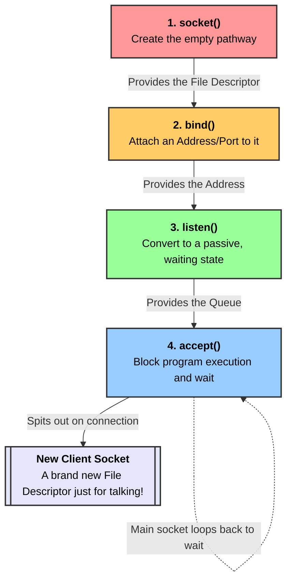

# Chapter 2: The Story of Socket Programming

## The Prologue: Trapped in a Box
**Why did we start?** We decided to build our own Redis—a blazing fast database that people from all over the world can talk to. 
**Why do we need this?** Right now, any C++ program we write is completely trapped inside our computer. It can calculate things, but it is completely deaf and mute to the outside world. To be a server, it needs a way to open a door and talk to the internet.
**How do we do it?** We have to build a digital Telephone System for our computer. To do this, we need to introduce four main characters into our story, one by one, exactly when we need them.

---

## Character 1: `socket()`
* **Why did we add this character?** We can't build a telephone system without a physical phone! We need something that can hold a conversation.

**Simple Meaning:** You are asking your computer to create a brand new, empty pathway that will eventually be used to send or receive data over the internet.
**Basic Analogy:** Buying a blank, disconnected smartphone from the store. It has no phone number, and it isn't connected to a cell tower yet.
**Advanced Technical Definition:** A POSIX system call that allocates an endpoint for communication within the operating system kernel and returns a File Descriptor (an integer). 
*Syntax:* `int fd = socket(AF_INET, SOCK_STREAM, 0);`

---

## Character 2: `bind()`
* **Why did we add this character?** We have our phone (`socket()`), but it's useless because it has no phone number. If a client across the world wants to call us, what number do they dial? We brought `bind()` into the story to give our phone an identity.

**Simple Meaning:** You use this to give your empty pathway a specific, recognizable address so that incoming internet traffic knows exactly where to find you.
**Basic Analogy:** Going to the phone company to get a SIM card and attaching a phone number (e.g., Port `1234`) to your blank smartphone.
**Advanced Technical Definition:** A system call that assigns a local protocol address (IP address and Port number) to an unnamed socket.
*Syntax:* `bind(fd, (struct sockaddr*)&addr, sizeof(addr));`
**Connection to the Story:** `bind()` connects directly to `socket()`. You pass the socket's File Descriptor (the phone) into `bind()` along with the address (the SIM card) to connect them together.

---

## Character 3: `listen()`
* **Why did we add this character?** Okay, we have a phone, and it has a number. But right now, our program isn't paying attention to it. If someone calls, it just rings into the void. We need a character to actively turn the ringer on and sit by the phone.

**Simple Meaning:** You are telling the computer, "I am a server. Do not try to call anyone else. Just sit here quietly, keep the door open, and wait for other people to call me."
**Basic Analogy:** Turning the smartphone on, turning the ringer volume all the way up, and setting up a "Please wait on hold" system for callers.
**Advanced Technical Definition:** A system call that marks a connected socket as a passive socket, meaning it will be used to accept incoming connection requests. The `SOMAXCONN` argument tells the OS how many callers it should allow to wait in the queue.
*Syntax:* `listen(fd, SOMAXCONN);`
**Connection to the Story:** You cannot `listen()` unless your socket has been assigned a specific address via `bind()`. The computer needs to know *which* address it is supposed to be listening on.

---

## Character 4: `accept()`
* **Why did we add this character?** The phone is ringing! But it will ring forever unless someone actually picks it up. We brought in `accept()` to be the person who answers the call and starts talking.

**Simple Meaning:** Your program will literally freeze and do nothing until a client connects. When a client finally connects, it creates a brand new pathway just for that client.
**Basic Analogy:** The phone rings, and you pick it up to talk. But to keep your main business line open, the phone company hands you a *second, temporary phone* just for this conversation, while your main phone goes right back to waiting for more calls.
**Advanced Technical Definition:** A blocking system call that extracts the first connection request on the queue of pending connections, creates a *new* connected socket, and returns a new file descriptor referring to that socket.
*Syntax:* `int client_fd = accept(fd, NULL, NULL);`
**Connection to the Story:** `accept()` relies entirely on the queue created by `listen()`. It pulls the next waiting customer out of that listening queue.

---

## 🗺️ The Story Diagram

Here is exactly how our four characters link together to save our trapped C++ program:

---

## 🕵️‍♂️ Deep Dive: The Code Parameters (Fixed vs. Changeable)

When writing C++ networking code, the syntax can look strange because we are interacting with old C code from the 1980s. Here is a breakdown of what the parameters mean, and **what you must keep fixed vs what you can change**.

### 1. `socket(AF_INET, SOCK_STREAM, 0);`
* **`AF_INET`:** Tells the OS to use standard IPv4 addresses (like `192.168.1.5`). 
* **`SOCK_STREAM`:** Tells the OS to use TCP (a reliable stream where words are guaranteed to arrive in perfect order).
* **`0`:** Means "just use the default protocol for this stream" (which is TCP).
* **Fixed or Changeable?** **Fixed.** Unless you want to build a completely different type of server (like UDP or IPv6), you must always use exactly these three parameters to build a TCP web server.

### 2. `struct sockaddr_in` and its properties
Because the socket API was written in C, it doesn't have C++ classes. It forces us to use a `struct` (Plain Old Data) so the operating system kernel can read it directly from memory without crashing.
* **`htons()`:** (Host TO Network Short). Some computers read numbers left-to-right, others right-to-left. `htons` flips your port number so the network always reads it correctly.
* **`INADDR_ANY`:** A shortcut meaning "Accept calls from any internet connection I have."
* **`sin_addr.s_addr`:** The C struct is nested like Russian nesting dolls. You have to go two levels deep (using two dots) to actually set the IP address.

**Fixed vs Changeable:**
* **Fixed:** The struct type **must** be `sockaddr_in`. The property names **must** be exactly `sin_family`, `sin_port`, and `sin_addr.s_addr`. You cannot rename these.
* **Changeable:** The variable name (e.g. `addr` can be renamed to `my_address`). The port number inside `htons(1234)` can be any number you want (e.g., Redis usually uses `6379`). The IP address can be changed to a specific IP if you don't want to use `INADDR_ANY`.

### 3. `bind(fd, (struct sockaddr*)&addr, sizeof(addr))`
* **`&addr`:** You pass the memory address of the struct, not the struct itself, for speed.
* **`(struct sockaddr*)`:** This is a **Type Cast**. `bind()` is a generic function that takes *any* type of address. By casting it, you are putting a fake cover sheet on your IPv4 struct that says "Generic Form" so the generic `bind()` function will accept it without complaining.
* **`sizeof(addr)`:** Because you disguised the struct as a generic form, the OS no longer knows how big it is. You must pass `sizeof(addr)` (which is 16 bytes) so the OS doesn't accidentally read past the end of the form into garbage memory.
* **Fixed or Changeable?** **Fixed.** You must always use the pointer `&`, the cast `(struct sockaddr*)`, and `sizeof()`. If you miss any of these, the code will either fail to compile or the server will crash instantly.
