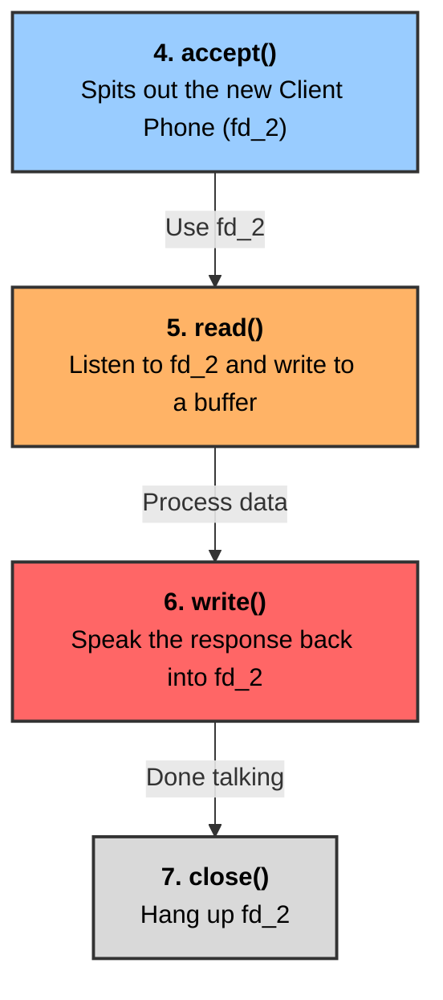

# Chapter 3: The TCP Server and Client (Reading and Writing)

## The Prologue: The Silent Phone Call

**Why did we start?** We successfully built our server in Chapter 2. It opens a port and waits for a call!
**Why do we need this chapter?** Right now, when a client calls us, our server picks up the phone (`accept()`) and then immediately hangs up. It doesn't say "Hello", and it doesn't listen to what the client wants. It is a completely silent phone call.
**How do we fix it?** Now that we have an active connection (the `fd_2` pathway), we need to introduce three new characters to allow our server to actually speak and listen: `read()`, `write()`, and `close()`.

---

## Character 5: `read()`

* **Why did we add this character?** The client is shouting data at us through the phone, but our program is ignoring it. We need a character to actively listen to the line and write down what they say.

**Simple Meaning:** Listening to the client speaking over the pathway and writing down what they say on a blank notepad.
**Basic Analogy:** Taking dictation over a phone call. You hold a blank piece of paper (a buffer) and write down exactly the letters you hear.
**Advanced Technical Definition:** A POSIX system call that attempts to read up to *count* bytes from a file descriptor into a buffer starting at *buf*.
*Syntax:* `ssize_t bytes_read = read(fd_2, buffer, sizeof(buffer));`
**Connection to the Story:** You call `read()` using the *new* client pathway (`fd_2`), not the main listening phone (`fd`).

---

## Character 6: `write()`

* **Why did we add this character?** Once we hear what the client says, we need a way to speak back to them (to reply with the data they asked for).

**Simple Meaning:** Speaking data into the pathway so it travels across the internet and arrives at the client.
**Basic Analogy:** Reading a message off a notepad directly into the phone so the person on the other end can hear it.
**Advanced Technical Definition:** A POSIX system call that writes up to *count* bytes from the buffer starting at *buf* to the file descriptor.
*Syntax:* `write(fd_2, response_buffer, sizeof(response_buffer));`
**Connection to the Story:** Just like `read()`, this is used exclusively on `fd_2` (the specific client's phone line).

---

## Character 7: `close()`

* **Why did we add this character?** When the conversation is over, if we don't hang up the phone, the line stays open forever. If this happens 5000 times, the computer runs out of phones and crashes!

**Simple Meaning:** Hanging up the phone when you are done talking.
**Basic Analogy:** Literally placing the phone back on the receiver.
**Advanced Technical Definition:** Closes a file descriptor, so that it no longer refers to any connection and the OS can recycle the integer.
*Syntax:* `close(fd_2);`

---

## 🗺️ The Story Diagram (Chapter 3)

Here is how the new characters plug into our story right after `accept()` happens:

---

## 🕵️‍♂️ Deep Dive: Errors in Thinking (Files, RAM, and the C++ Brain)

When moving from Chapter 2 to Chapter 3, it is very easy to fall into a few logical traps regarding how computers handle data. Here are the core "Errors in Thinking" and how to correct them:

### Trap 1: Thinking a "Buffer" is a "File"
* **The Error:** You assume that when we save data, we are writing it to a file on the hard drive.
* **The Reality:** A buffer is **NOT** a file. A buffer (like `char buffer[1024];`) is a temporary blank whiteboard that lives purely in your computer's **RAM (Short-Term Memory)**. The moment the program exits, the whiteboard is wiped clean and disappears. Redis is famous for being incredibly fast *because* it keeps everything on these RAM whiteboards and avoids using slow hard drive files.

### Trap 2: Thinking `read()` understands English
* **The Error:** You assume the `read()` function hears the word "Hey!" and processes it as an English word.
* **The Reality:** `read()` is like a blind worker with a shovel. It does not know what a string, image, or video is. When the client sends "Hey", it travels across the wire as binary electrical signals (1s and 0s). `read()` just blindly shovels those raw bytes into your RAM buffer. The processing only happens later when you call `cout`, which uses the ASCII table to translate those raw numbers (e.g., `72 101 121`) back into the English letters "Hey" on your screen.

### Trap 3: Thinking you need a `for` loop to print an Array
* **The Error:** If `buffer` is just an array of characters, you logically think you need to write a `for` loop to print each index one by one.
* **The Reality:** The creators of C++ built a hidden trick into `cout`. When you type `cout << buffer;`, you are actually just handing `cout` the memory address of the 0th index. However, `cout` has a hidden `for` loop inside it! It will start at index 0 and print every character it sees until it hits a **Null Terminator (`\0`)**. 
  * *Note on Spaces:* A space (` `) is not empty; it is ASCII character `32`. `cout` will print the space and keep going. It only stops when it hits the invisible zero (`\0`) at the very end of the string!
