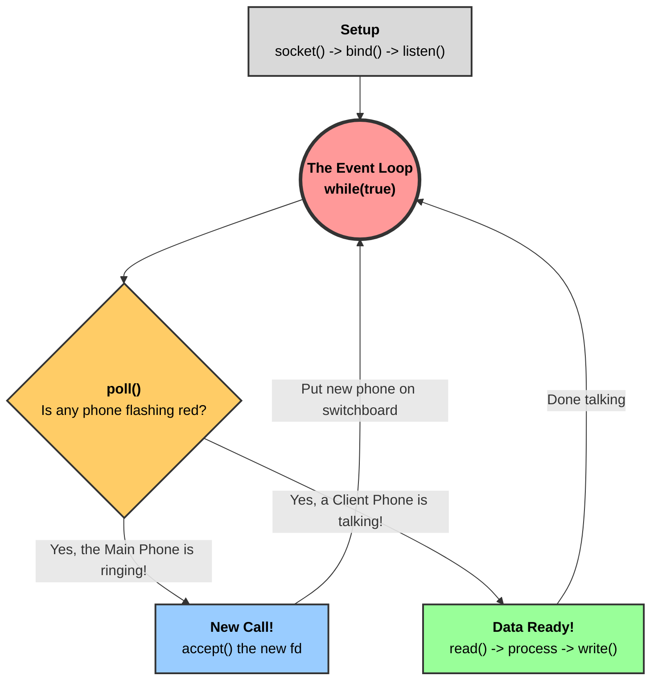

# Chapter 4: The Event Loop (Handling Multiple Callers)

## The Prologue: The Lazy Employee

**Why did we start?** We built a working server in Chapter 3. It accepts a call, reads the data, replies, and hangs up.
**Why do we need this chapter?** Right now, our server has two fatal flaws:

1. After it answers exactly ONE phone call, it reaches `return 0;`, the program terminates, and the server dies!
2. If we put it in a simple `while(true)` loop to stop it from dying, it will freeze on `read()` if a client calls but doesn't speak. While it sits there waiting for that one silent client, 1,000 other customers are getting a busy signal!

**How do we fix it?** We need to hire a superhuman employee and install a magical alarm system on our phones.

---

## The Bad Idea: Hiring 1,000 Employees (Multithreading)

The traditional way to solve this problem (used by Apache web servers) is to hire a new employee (a **Thread**) every time the phone rings.
If 1,000 clients call, you hire 1,000 employees.

* **The Problem:** Employees are expensive! Each thread takes up heavy RAM and CPU power. If 10,000 people call, your computer runs out of memory and crashes.
* **The Redis Secret:** Redis is famous for being **Single-Threaded**. It only ever hires ONE employee to handle all 10,000 phone calls! How?

---

## Character 8: The Event Loop (`while(true)`)

* **Why did we add this character?** We need our single employee to never go home. They need to work an infinite shift.

**Simple Meaning:** An infinite loop that keeps the server alive forever.
**Basic Analogy:** A worker sitting in a spinny chair in the center of a room, surrounded by 10,000 phones, continuously spinning in circles waiting for work.
**Advanced Technical Definition:** An infinite `while(true)` loop that forms the core heartbeat of the application, ensuring the main process never hits `return 0;`.

---

## Character 9: The Alarm System (`poll` / `epoll`)

* **Why did we add this character?** If our one employee picks up a phone and the client is a slow typer, the employee is stuck. We need a system that tells the employee: *"Only pick up a phone if there is already a message ready to be read!"*

**Simple Meaning:** A giant switchboard that monitors all 10,000 phones at the same time and flashes a red light over the exact phone that has a message ready.
**Basic Analogy:** Instead of picking up every phone to check if someone is there, the employee just stares at the switchboard. When Phone #402 flashes red, the employee spins their chair, grabs Phone #402, quickly reads the message, and spins back to the switchboard.
**Advanced Technical Definition:** **I/O Multiplexing**. Functions like `poll()`, `select()`, or `epoll()` ask the Operating System to monitor an array of File Descriptors. The OS blocks the program until at least one File Descriptor is ready for a non-blocking `read()` or `write()`.

---

## 🗺️ The Story Diagram (Chapter 4)

Here is how the Event Loop turns our program into a true, non-stop Redis server:

