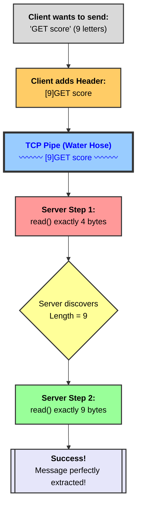

# Chapter 5: The Protocol (Message Framing)

## The Prologue: The Water Hose Problem
**Why did we start?** We built a highly scalable Event Loop in Chapter 4. Our single employee can manage 10,000 callers at the exact same time!
**Why do we need this chapter?** As we discovered, TCP (the internet) is not a series of neat text messages (envelopes). It is a continuous **hose of water**.
If a client pours `SET name Shadow` into the pipe, and 0.001 seconds later pours `GET name`, the water mixes into one giant block: `SET name ShadowGET name`. 
If the internet is lagging, our `read()` bucket might only scoop up `SET na`. 

If the server cannot tell where one command ends and the next begins, our database will crash.

---

## The Bad Idea: Special Characters (Delimiters)
Your first instinct might be to use a special symbol to separate the commands. For example, what if we forced every command to end with a `#`?
`SET name Shadow#GET name#`

Now the server can just search for the `#` to chop the water apart!
* **The Fatal Flaw:** What if a user wants to save their password in the database, and their password is `Shadow#123`?
If they send `SET password Shadow#123#`, the server will see the first `#`, chop the word in half, and save their password as `Shadow`! This is a massive bug. We cannot ban users from using certain characters.

---

## The Redis Solution: The Length Header (TLV)
Instead of searching for a special character, Redis uses a brilliant and simple rule: **Before you speak, you must announce exactly how many letters you are going to say.**

If the client wants to say `hello` (which is 5 letters), they don't just send `hello`. They send:
`[5]hello`

This completely solves the water hose problem! Here is exactly how the server handles it:

### Step 1: Read the Header
The server holds its bucket under the pipe and asks to read **exactly 4 bytes** (the size of an integer). It doesn't read the whole pipe, just the first 4 bytes. 
The server pulls out the number `5`.

### Step 2: Read the Message
Now that the server knows the message is exactly 5 bytes long, it puts its bucket back under the pipe and asks to read **exactly 5 bytes**. 
It pulls out `hello`. 

### Step 3: Stop and Wait
Even if the client poured 100 other commands into the pipe, the server successfully extracted exactly one command without mixing them up, and without banning any special characters!

---

## 🗺️ The Story Diagram (Chapter 5)

Here is how our custom Protocol works in action:



---

## The Code Implementation
To make this work in C++, we have to write a custom helper function called `read_full()`. 
Because `read()` is unpredictable and might not grab all the water at once, `read_full()` will put the bucket under the pipe in a `while` loop, scooping over and over again until it has gathered the *exact* number of bytes we asked for.

---

## 🕵️‍♂️ Deep Dive: Errors in Thinking (Bytes, Pointers, and Casting)

### Trap 1: Thinking a `char` is 2 bytes
* **The Error:** You assume each character takes 2 bytes (like in Java or JavaScript), so `hello` = 10 bytes.
* **The Reality:** In C++, a `char` is always exactly **1 byte**. So `hello` = 5 characters × 1 byte = **5 bytes**.

Here is the official size table:

| Type | Size | Example |
|------|------|---------|
| `char` | 1 byte | `'H'` |
| `int` | 4 bytes | `42` |
| `uint32_t` | 4 bytes (guaranteed) | `10` |
| `long` | 8 bytes | `999999999` |

### Trap 2: Not understanding why `buf += bytes_scooped` moves the pointer
* **The Error:** You think moving the pointer is pointless because we could just read everything into index 0.
* **The Reality:** If the internet is slow and `read()` only scoops 3 bytes on the first try, those 3 bytes land in boxes 0, 1, 2. If we call `read()` again WITHOUT moving the pointer, it would pour the next batch of water right back into box 0, **destroying** the first 3 bytes!

**Visual Example (reading `hello` = 5 bytes, but internet is slow):**

```
BEFORE first read() — buf points at box 0:
buf ↓
[ _ ][ _ ][ _ ][ _ ][ _ ]
  0    1    2    3    4

AFTER first read() scoops 3 bytes — we got H, e, l:
buf ↓
[ H ][ e ][ l ][ _ ][ _ ]
  0    1    2    3    4

We do buf += 3 to slide the pointer forward:
               buf ↓
[ H ][ e ][ l ][ _ ][ _ ]
  0    1    2    3    4

AFTER second read() scoops 2 bytes — we got l, o:
                          buf ↓
[ H ][ e ][ l ][ l ][ o ]
  0    1    2    3    4

Done! n = 0, the while loop exits. Buffer contains "hello".
```

Without `buf += bytes_scooped`, the second `read()` would have overwritten box 0 and 1, and our buffer would contain `lollo` instead of `hello`!

### Trap 3: How can the SAME `read_full` function accept an `int` AND a `char[]`?
* **The Error:** We call `read_full` twice with completely different types:
  * Call 1: `read_full(client_fd, (char*)&message_length, 4)` — where `message_length` is a `uint32_t` (an integer!)
  * Call 2: `read_full(client_fd, message_buffer, 4096)` — where `message_buffer` is a `char[]` (a character array!)
  
  How can the same function handle both without overloading?

* **The Reality:** The secret is `(char*)`. This is called **casting**. When we write `(char*)&message_length`, we are lying to C++:
  *"Hey C++, I know `message_length` is an integer living in 4 bytes of RAM. But forget that. Just treat those 4 bytes as 4 empty boxes of raw memory."*
  
  To `read_full`, it doesn't matter what those boxes are "supposed to be." It just blindly fills boxes with raw bytes from the pipe.
  
  * For Call 1: `read()` pours 4 bytes of raw water into the integer's 4 boxes. After the function returns, C++ looks at those 4 filled boxes and says: *"Oh wait, this is a `uint32_t`. Let me interpret these 4 raw bytes as a number!"* And the number `5` (or `10`, or whatever the client sent) magically appears.
  * For Call 2: `message_buffer` is already a `char[]`. In C++, an array name automatically decays into a pointer to its first element. So it is already a `char*` — exactly what the function expects. No casting needed!

**The Key Insight:** At the lowest level, RAM is just a row of empty boxes. `read()` does not care if a box is "supposed to be" an integer or a letter. It just fills boxes with raw water from the pipe. The meaning of those bytes is decided later by the rest of your code!
