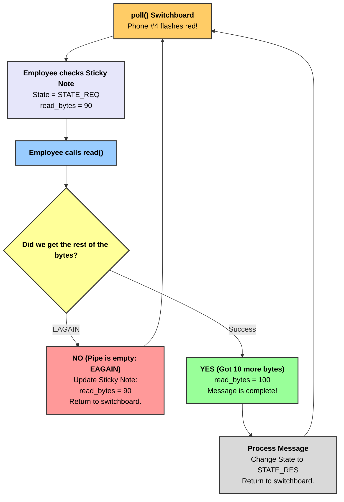

# Chapter 6: Non-Blocking I/O & The State Machine

## The Prologue: The Paralyzed Employee
**Why did we start?** In Chapter 5, we solved the "TCP Water Hose" problem by inventing a Protocol with a Length Header and a `read_full` function. 
**Why do we need this chapter?** Our `read_full` function has a deadly flaw: it uses a `while` loop that *blocks* the thread until all the water is collected.
If a malicious hacker connects, promises 10,000 bytes, sends only 90 bytes, and then goes to sleep, our single employee will freeze holding the bucket forever. The entire server goes offline. 

**How do we fix it?** We need to upgrade our phones so they never freeze, and we need to give our employee a pad of sticky notes.

---

## Character 11: Non-Blocking Phones (`O_NONBLOCK`)
By default, all File Descriptors (Phones) in Linux and Mac are **Blocking**. If you call `read()` and the pipe is empty, the operating system literally pauses your entire program and forces you to wait until water arrives. 

We can fix this by telling the Operating System: *"Please make this phone Non-Blocking."*
When a phone is Non-Blocking, `read()` will scoop whatever water is there. If the pipe is completely empty, `read()` will NOT pause the program. Instead, it instantly returns an error code called `EAGAIN` (which basically means: *"I am empty right now, try again later!"*).

This perfectly saves our employee from freezing! They can put the bucket down and return to the switchboard.

---

## Character 12: The Sticky Note (`struct Conn`)
If our employee puts the bucket down to go help someone else, how will they remember what they were doing when they come back to this phone 10 minutes later? 

They need a sticky note! In C++, we will create a `struct Conn` (Connection) for every single client on the switchboard. 

```cpp
struct Conn {
    int fd = -1;             // Which phone is this?
    uint32_t state = 0;      // What was I doing? (Reading? Writing?)
    
    // The bucket for scooping water
    size_t read_bytes = 0;   // How many drops have I scooped so far?
    uint8_t read_buf[4096];  // The actual bucket holding the water
};
```

Whenever the employee gets the `EAGAIN` error, they quickly write down: *"I have scooped exactly 90 bytes into this bucket so far,"* stick the note to the phone, and spin back to the switchboard. 

---

## Character 13: The State Machine
Because the employee is constantly jumping between 10,000 different phones, they need a very strict set of rules to know what to do when they pick up a phone. This is called a **State Machine**. 

Our employee will only ever be in one of three States for a customer:
1. `STATE_REQ` (State Request): The employee is currently trying to read data from the pipe.
2. `STATE_RES` (State Response): The employee has finished reading, processed the data, and is currently trying to push the response into the pipe. 
3. `STATE_END` (State End): The conversation is over and the phone should be destroyed.

---

## 🗺️ The Story Diagram (Chapter 6)

Here is how our single employee juggles multiple slow customers without ever freezing:


