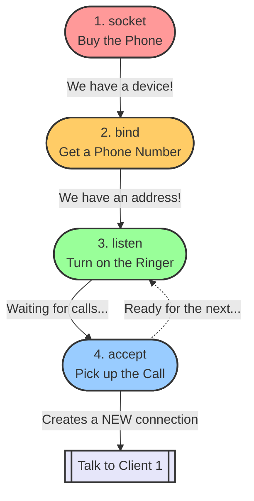

# Socket Programming Basics

Here is a visual map of how the 4 core socket functions connect to each other to create a server.

### What's going on here?
- Everything flows from top to bottom when you start your server.
- Once you reach **`accept()`**, the server pauses and waits.
- When a client connects, `accept()` spits out a brand new connection just for that client, while the main phone goes back to listening for more calls!
